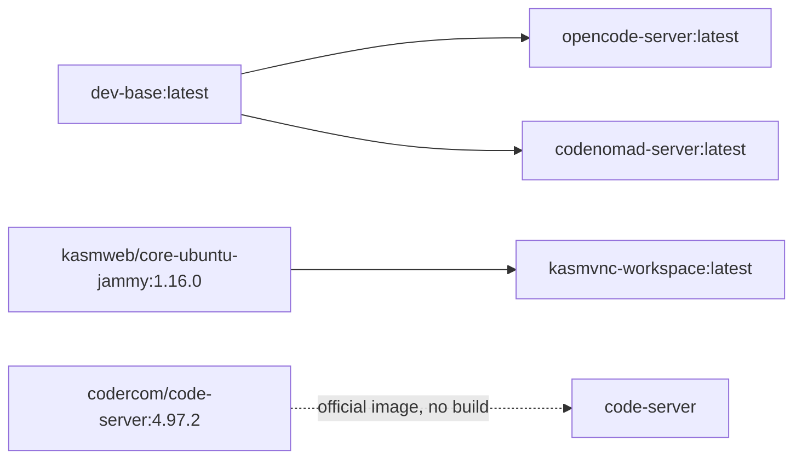

# Self-Hosted Workspace MVP — Deployment & Operations

## Architecture Overview

Four browser-accessible services behind Dokploy/Traefik HTTPS:

| Domain | Service | Internal Port | Auth |
|--------|---------|-------------|------|
| `code.workspace.dev` | code-server (VS Code) | 8080 | Password |
| `ai.workspace.dev` | opencode-server | 4096 | HTTP Basic |
| `codenomad.workspace.dev` | CodeNomad | 9898 | User/Password |
| `desktop.workspace.dev` | KasmVNC (Desktop) | 6901 | VNC Password |

All services share the `workspace-net` bridge network. Traefik is the sole ingress — no host ports are published.

## Prerequisites

- **Dokploy** instance on Oracle Cloud A1 Flex (ARM64, 4 OCPU, 24 GB RAM)
- **Traefik** enabled in Dokploy with Let's Encrypt certificate resolver
- **Cloudflare Access** policies configured for the 4 subdomains above
- **Docker CE 24+** with buildx (for ARM64 image builds on non-ARM64 hosts)

## Deployment

### 1. Pre-deploy: Create External Volumes

These volumes hold project data and user config. They must exist before the first deploy:

```bash
docker volume create workspace_projects
docker volume create workspace_profile
docker volume create workspace_home
docker volume create opencode_config
docker volume create codenomad_config
docker volume create code_server_config
docker volume create kasm_config
docker volume create toolchains
docker volume create package_caches
```

Alternatively, run the bootstrap script (requires root on the Docker host):

```bash
sudo ./scripts/bootstrap.sh
```

This creates the top-level directory structure inside `workspace_projects`, `workspace_profile`, and `toolchains` with UID 1000 ownership, ensuring all services can write without permission errors.

### 2. Set Environment Variables in Dokploy

Open Dokploy → your service → Environment and set these variables:

| Variable | Required | Notes |
|----------|----------|-------|
| `ANTHROPIC_API_KEY` | Yes | For AI completions (opencode + CodeNomad) |
| `OPENAI_API_KEY` | Yes | For AI completions (opencode + CodeNomad) |
| `CODE_SERVER_PASSWORD` | Yes | code-server login |
| `OPENCODE_SERVER_USERNAME` | No | Defaults to `opencode` |
| `OPENCODE_SERVER_PASSWORD` | Yes | opencode HTTP Basic auth |
| `CODENOMAD_SERVER_USERNAME` | Yes | CodeNomad login |
| `CODENOMAD_SERVER_PASSWORD` | Yes | CodeNomad login |
| `KASMVNC_PASSWORD` | Yes | KasmVNC desktop login |

Do NOT commit real values to any file. Use `.env.example` as a reference only.

### 3. Deploy via Dokploy

1. Link your Git repository to Dokploy.
2. Create a **Compose** service type.
3. Point to `docker-compose.yml` in the repository root.
4. Dokploy detects the Compose file, creates containers, networks, and auto-created volumes.
5. Service health is reported in the Dokploy dashboard.

### 4. Post-Deploy Validation

Run the smoke test suite (on the target host):

```bash
./scripts/smoke-test.sh
```

This verifies: image builds, container health, service endpoints, cross-container volume sharing, secret isolation, and restart persistence.

For individual checks:

```bash
./scripts/arm64-validate.sh          # Verify ARM64 image compatibility
./scripts/secret-audit.sh            # Inspect images for embedded secrets
```

## Image Build Flow



Build order:
1. `dev-base/Dockerfile` — shared ARM64 base (Ubuntu Jammy + Node.js + Bun + pnpm + Git)
2. `opencode/Dockerfile` — opencode server (FROM dev-base)
3. `codenomad/Dockerfile` — CodeNomad with opencode CLI (FROM dev-base)
4. `kasmvnc/Dockerfile` — desktop with dev tools (FROM kasmweb/core-ubuntu-jammy)
5. `code-server` — official image, pulled directly

To build all custom images:

```bash
docker compose build
```

## Volume Reference

| Volume | Mounted In | Purpose | Persistence |
|--------|-----------|---------|-------------|
| `workspace_projects` | All services | Repositories and working files | External (manual create or bootstrap) |
| `workspace_profile` | opencode, code-server, KasmVNC | `~/.config`, `~/.ssh`, OAuth tokens | External |
| `workspace_home` | KasmVNC | Desktop session home | Auto-created |
| `opencode_config` | opencode, CodeNomad (ro) | Global config, skills, agents, MCP | Auto-created |
| `codenomad_config` | CodeNomad | Sessions, chat history | Auto-created |
| `code_server_config` | code-server | VS Code extensions and settings | Auto-created |
| `kasm_config` | KasmVNC | VNC password and desktop settings | Auto-created |
| `toolchains` | opencode, CodeNomad | User-installed binaries (`~/.local/bin`) | External |
| `package_caches` | opencode, CodeNomad | npm/pnpm/bun caches | Auto-created |

**Project data (`workspace_projects`) is always separate from tool configuration.**

## Rollback

Redeploy the previous Dokploy service revision:

1. Dokploy → Service → Deployments → select the previous revision → Deploy.
2. External volumes (`workspace_projects`, `workspace_profile`, `toolchains`) are NOT recreated — they persist with all data.
3. Auto-created volumes are recreated only if you use `docker compose down -v` (do NOT do this during rollback).

**To manually roll back:**

```bash
docker compose down
git checkout <previous-deploy-tag>
docker compose up -d
```

## Secret Management

| Layer | Where | Example |
|-------|-------|---------|
| API keys, passwords | Dokploy env vars (never committed) | `ANTHROPIC_API_KEY` |
| SSH keys | `workspace_profile` volume | `~/.ssh/id_ed25519` |
| OAuth tokens | `workspace_profile` volume | Git credential helpers |
| Image layers | None — no `ARG` or `ENV` secrets | Verified by `scripts/secret-audit.sh` |
| Repository | `.env.example` — placeholders only | Verified by `scripts/secret-audit.sh` |

## UID/GID Strategy

All containers run as UID 1000:GID 1000 for shared-volume compatibility:

| Container | User | UID |
|-----------|------|-----|
| code-server | `coder` | 1000 |
| opencode-server | `workspace` | 1000 |
| codenomad-server | `workspace` | 1000 |
| kasmvnc-workspace | `kasm-user` | 1000 |

Do NOT run `chown` at runtime — UID is set at image build time.

## Resource Limits

| Container | Memory Limit | Notes |
|-----------|-------------|-------|
| kasmvnc-workspace | 4 GB (Compose `deploy.resources.limits.memory`) | Prevents desktop OOM-killing the host |
| All others | Unbounded (host scheduler) | Monitor with `docker stats` |

KasmVNC also uses `shm_size: 2gb` for shared memory (required by Chromium-based browsers).

## Monitoring

- **Dokploy dashboard**: Service health, logs, resource usage
- **`docker compose ps`**: Container state
- **`docker compose logs -f`**: Real-time logs per service
- **`docker stats`**: Live resource consumption
- **Health checks**: Every service has a configured Docker health check

## Known Limitations (MVP)

- No automated backups (manual `docker volume backup` commands)
- No multi-tenancy — single user workspace
- KasmVNC desktop limited to 4 GB RAM — restart if OOM-killed

## Troubleshooting

| Symptom | Likely Cause | Fix |
|---------|-------------|-----|
| `workspace_projects` write errors | Volume owned by wrong UID | Run `sudo ./scripts/bootstrap.sh` |
| Container exits immediately | Missing required env var | Check Dokploy env UI for missing vars |
| KasmVNC desktop blank/noVNC timeout | Memory limit hit or shm_size too small | Restart container; check `docker logs` |
| opencode health fails with 401 | `OPENCODE_SERVER_PASSWORD` not set | Add it to Dokploy env vars |
| CodeNomad unreachable | Traefik routing to wrong port | Verify `traefik.http.services.codenomad.loadbalancer.server.port=9898` and `server.scheme=https` |
| Image build fails on amd64 | Missing buildx or QEMU | Run `./scripts/arm64-validate.sh` for setup |
